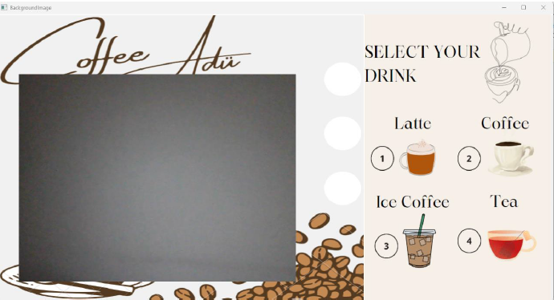

# Coffee Machine Virtual Interface Using Computer Vision
 
# Hand Gesture Control Interface

## Açıklama

Bu proje, webcam ve el hareketlerini kullanarak bir arayüz kontrol sistemi oluşturur. OpenCV ve CVZone kullanarak, kullanıcının el hareketlerini algılar ve çeşitli görsel modları ve simgeleri kontrol eder. Elin parmak sayısına göre seçim yapabilir ve arka plan görüntüsündeki ilgili simgeleri güncelleyebilirsiniz.

# Sanal Kahve Makinesi Kontrol Sistemi

Bu proje, el hareketleri kullanarak bir sanal kahve makinesini kontrol etmenizi sağlar. Kullanıcılar, belirli el hareketleriyle kahve türünü, şeker miktarını ve kahve boyutunu seçebilirler.

## Kahve Türü Seçimi

Kullanıcı, arayüz üzerinden farklı kahve türlerini seçebilir. Belirli bir el hareketi ile kahve türü seçilir. Örneğin, tek parmak kaldırmak latte'yi, üç parmak kaldırmak ise soğuk kahveyi temsil edebilir.


## Şeker Miktarı Seçimi

Kahvedeki şeker miktarı, belirli el hareketleriyle belirlenir. Şeker miktarını göstermek için elin farklı parmaklarını kullanabilirsiniz.


## Kahve Boyutu Seçimi

Kahve boyutu da benzer şekilde belirli el hareketleri ile seçilir. Küçük, orta veya büyük boyut seçeneklerini belirlemek için uygun parmak hareketlerini yapabilirsiniz.


## Sonuç

Sonuç olarak, kullanıcı el hareketleri ile büyük bir latte ve iki şekerli bir kahve siparişi verebilir.


## Gereksinimler

- Python 3.x
- OpenCV
- CVZone

Bu kütüphaneleri yüklemek için aşağıdaki komutları kullanabilirsiniz:

```bash
pip install opencv-python
pip install cvzone


